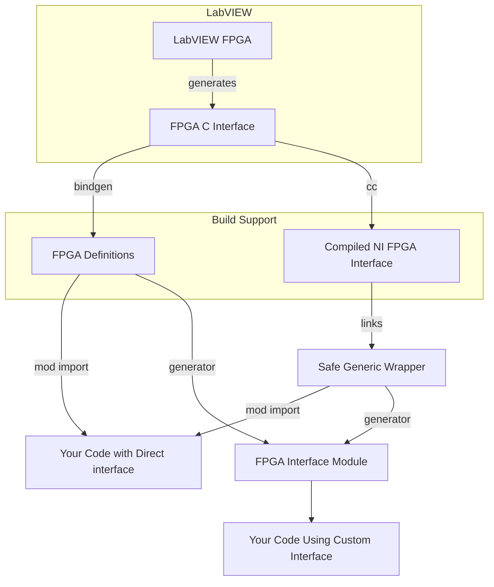

# ni-fpga-interface
NI FPGA Interface for Rust

This crate is designed to make it easy to talk to a LabVIEW FPGA.

## Requirements

* You need CLang installed and to be on the path for the C header pre-processing.
* The C interface needs to be exported with the "prefix" set to something without spaces and we expect a single directory with the NiFpga C and H files.

## Examples

See the examples folder for some fully worked examples including build support.

## Architecture

The principle behind this approach is going to be to use as much of the generated C as possible instead of pre-building against the expected interface.

This should make us as version independent as possible and reduce the complexity where NI have already solved problems in the generated C code.

It may take time but this builds through 3 layers of abstraction:

1. The C calls generated by NI.
2. A safe wrapper around the C calls in Rust.
3. A generated Rust interface for the specific FPGA bitfile/interface you have provided.

The diagram shows the key components and targeted workflow. Names will probably change.

There are 3 key components to this project:

1. Build Support to make it easy to take an FPGA-generated C interface and build it into your Rust project.
2. Safe wrapper so you don't have to call the unsafe functions directly.
3. FPGA Interface generator which will generate a struct in Rust which provides easy access to the interface of a specific FPGA.

### Custom Type Support

We will need to support fixed point and clusters which come in as custom types in C. 

This needs some code generation as part of the build support to enable a safe wrapper for these types.

### Cross Compilation

Cross-compilation should be a first-class consideration to ensure this is easy to use against a compactRIO target.

## Planned Approach

1. Tackle the build support.
2. Get the safe wrapper working for standard types.
3. Get the safe wrapper working for custom types.
4. Tackle API generation for a single bitfile.
5. See if there is a sensible route to abstract the interface across multiple bitfiles (ala Dynamic Interface in LabVIEW)

I'm going to start with this as a single crate but it may make sense to split it later.
